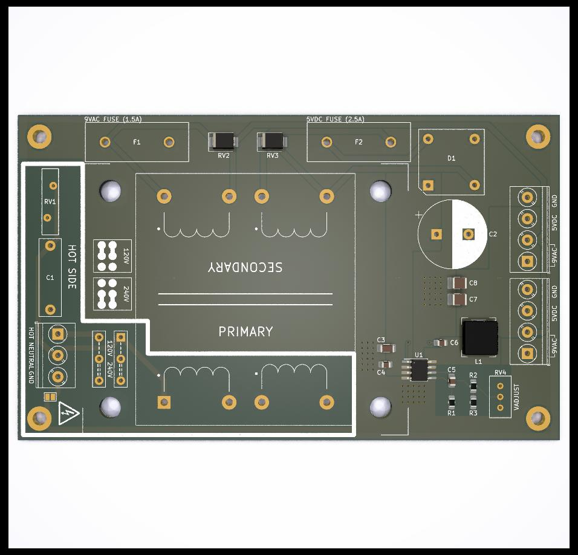
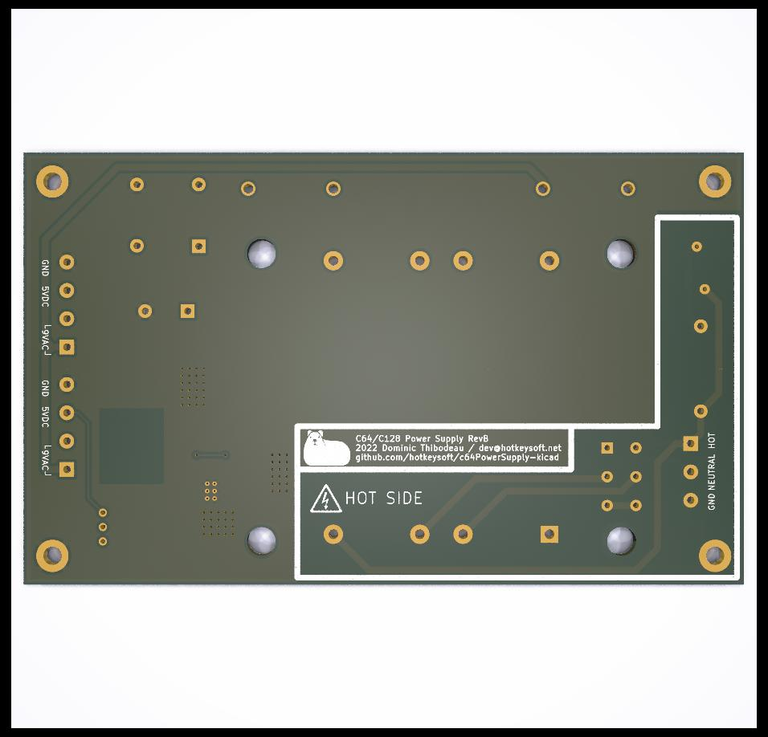
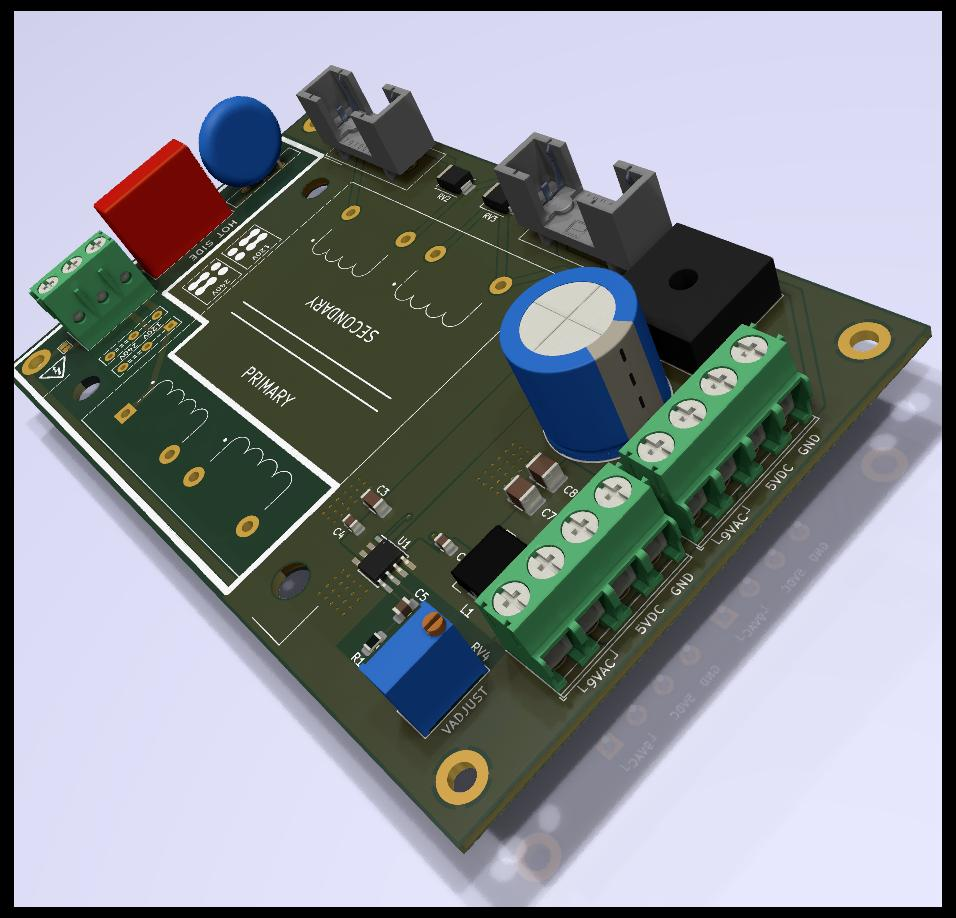

# C64 Power Supply
Rev B September 2022

### Basic Tests: complete

This was version was built and tested 40 minutes @ 2.5A on the 5V line with no issue. 
- Heat dissipation could be a problem in an plastic enclosure, will need more tests.
  - Regulator dissipates heat through ground plane so a metal case (and metal stand-offs) could be enough

### Simple Switching Power Supply
- 120/240VAC Input (toggle with jumpers)
- Beefier transformer (56VA)
- TVS diodes on both transformer output lines (optional)
- MOV and filtering cap on input side (optional)
- 9VAC Output 1.5A Max w/Fuse
- 5VDC Output 3A Max w/Fuse, more than enough for C128
- +5V Adjustable with trimmer
- BD9E303EFJ Buck switching regulator for +5V output
  - In theory more efficient than old LM2596T, tests will tell 
- Two terminal blocks to use the power supply with either a C64 or a C128
  - *NOT* at the same time...
    - 9VAC line should be fine in theory (transformer can provide 3A). Altough noise/crosstalk could be an issue.
    - 5V line could overload. The max capacity of this switching regulator is 3A. C128 uses around 2A by itself, with nothing connected. C64 is rated to use 1.5A. Not responsible if someone powers both at the same time.

Images
============
|Front                                                 | Back                                              |
|------------------------------------------------------|---------------------------------------------------|
|||

### Schematics (pdf)
- [Complete schematics](./img/schema.pdf)

### PCB Images (svg)
- [Top](./img/pcb-front.svg)
- [Bottom](./img/pcb-back.svg)
